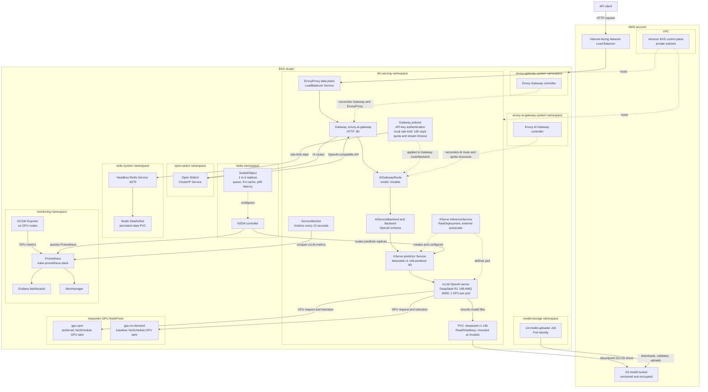

```mermaid
flowchart TB
    Client["API client"]

    subgraph AWS["AWS account"]
        NLB["Internet-facing Network Load Balancer"]
        S3["S3 model bucket\nversioned and encrypted"]
        subgraph VPC["VPC"]
            EKS["Amazon EKS control plane\nprivate subnets"]
        end
    end

    subgraph Cluster["EKS cluster"]
        subgraph GatewaySystem["envoy-gateway-system namespace"]
            EnvoyController["Envoy Gateway controller"]
        end

        subgraph AIGatewaySystem["envoy-ai-gateway-system namespace"]
            AIController["Envoy AI Gateway controller"]
        end

        subgraph Serving["llm-serving namespace"]
            Gateway["Gateway: envoy-ai-gateway\nHTTP :80"]
            EnvoyProxy["EnvoyProxy data plane\nLoadBalancer Service"]
            Route["AIGatewayRoute\nmodel: /models"]
            Backend["AIServiceBackend and Backend\nOpenAI schema"]
            Policies["Gateway policies\nAPI-key authentication\nlocal rate limit: 100 req/s\nquota and stream timeout"]
            PredictorService["KServe predictor Service\ndeepseek-r1-14b-predictor :80"]
            InferenceService["KServe InferenceService\nRawDeployment; external autoscaler"]
            vLLM["vLLM OpenAI server\nDeepSeek R1 14B AWQ\n:8000; 1 GPU per pod"]
            ModelPVC["PVC: deepseek-r1-14b\nReadOnlyMany; mounted at /models"]
            ServiceMonitor["ServiceMonitor\n/metrics every 15 seconds"]
        end

        subgraph OpenWebUI["open-webui namespace"]
            WebUI["Open WebUI\nClusterIP Service"]
        end

        subgraph RedisSystem["redis-system namespace"]
            RedisService["Headless Redis Service :6379"]
            Redis["Redis StatefulSet\npersistent data PVC"]
        end

        subgraph Monitoring["monitoring namespace"]
            DCGM["DCGM Exporter\non GPU nodes"]
            Prometheus["Prometheus\nkube-prometheus-stack"]
            Grafana["Grafana dashboards"]
            Alertmanager["Alertmanager"]
        end

        subgraph Autoscaling["keda namespace"]
            KEDA["KEDA controller"]
            ScaledObject["ScaledObject\n1 to 6 replicas\nqueue, KV-cache, p99 latency"]
        end

        subgraph ModelStorage["model-storage namespace"]
            Uploader["s3-model-uploader Job\nPod Identity"]
        end

        subgraph GPUCompute["Karpenter GPU NodePools"]
            Spot["gpu-spot\npreferred; NoSchedule GPU taint"]
            OnDemand["gpu-on-demand\nbaseline; NoSchedule GPU taint"]
        end
    end

    Client -->|"HTTP request"| NLB
    NLB --> EnvoyProxy
    EnvoyProxy --> Gateway
    Gateway --> Route
    Route --> Backend
    Backend --> PredictorService
    PredictorService --> vLLM

    Gateway -->|"UI routes"| WebUI
    WebUI -->|"OpenAI-compatible API"| Gateway

    Policies -.->|"applied to Gateway route/backend"| Route
    Policies -->|"rate-limit state"| RedisService
    RedisService --> Redis

    InferenceService -.->|"creates and configures"| PredictorService
    InferenceService -.->|"defines pod"| vLLM
    vLLM -->|"mounts model files"| ModelPVC
    ModelPVC -->|"Mountpoint S3 CSI driver"| S3
    Uploader -->|"downloads, validates, uploads"| S3

    vLLM -->|"GPU request and toleration"| Spot
    vLLM -->|"GPU request and toleration"| OnDemand
    DCGM -->|"GPU metrics"| Prometheus
    ServiceMonitor -->|"scrapes vLLM metrics"| Prometheus
    Prometheus --> Grafana
    Prometheus --> Alertmanager

    KEDA -->|"queries Prometheus"| Prometheus
    ScaledObject -.->|"configures"| KEDA
    KEDA -->|"scales predictor replicas"| PredictorService

    EnvoyController -.->|"reconciles Gateway and EnvoyProxy"| Gateway
    AIController -.->|"reconciles AI route and quota resources"| Route
    EKS -.->|"hosts"| GatewaySystem
    EKS -.->|"hosts"| Serving
```